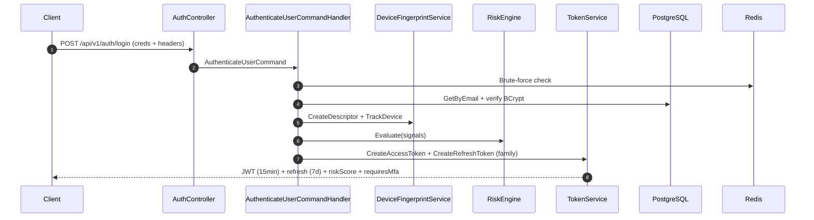

# Rbac.Api — Enterprise RBAC & Adaptive Security platform (.NET 8)

[](https://dotnet.microsoft.com/)
[](https://www.postgresql.org/)
[](https://redis.io/)
[](https://jwt.io/)
[](#license)

> Production-grade ASP.NET Core 8 backend that combines a full **Role + Permission** model (RBAC) with a layered **adaptive security** pipeline: refresh-token rotation with reuse detection, device fingerprinting, geolocation-aware risk scoring, brute-force protection, TOTP MFA, session intelligence, and OpenTelemetry/Prometheus observability.

---

## Table of contents

1. [Overview](#overview)
2. [Architecture](#architecture)
3. [Security model](#security-model)
4. [Tech stack](#tech-stack)
5. [Project layout](#project-layout)
6. [Getting started](#getting-started)
7. [Configuration](#configuration)
8. [Database & migrations](#database--migrations)
9. [API surface](#api-surface)
10. [Usage examples](#usage-examples)
11. [Permission catalog](#permission-catalog)
12. [Observability](#observability)
13. [Security hardening checklist](#security-hardening-checklist)
14. [Testing](#testing)
15. [Docker](#docker)
16. [Roadmap](#roadmap)
17. [License](#license)

---

## Overview

`Rbac.Api` is an opinionated reference implementation of an **enterprise IAM building block**. It is **not** a hello-world JWT demo — it implements the controls a real organization would expect from an in-house authentication service:

- Stateless **JWT** access tokens with **refresh-token rotation** and **token-family reuse detection**.
- Granular **RBAC** with permissions resolved from `User → Role → Permission` (with direct user-level overrides).
- **Adaptive security**: every login and refresh computes a risk score based on device fingerprint, geolocation, IP reputation, brute-force signals, impossible travel, and refresh abuse.
- **TOTP-based MFA** with QR-code provisioning and hashed recovery codes.
- **Session intelligence**: tracked devices, current/active/suspicious/compromised sessions, geolocation history.
- **Auditability**: every request masked and persisted, every security event written to a dedicated table.
- **Hardened middleware pipeline**: rate limiting, security headers, CSP, threat detection, exception sanitisation.
- **First-class observability**: structured Serilog logs, OpenTelemetry traces and metrics, Prometheus scrape endpoint.

It is designed as a portfolio-grade codebase: Clean Architecture, CQRS with MediatR, FluentValidation, IDesignTimeDbContextFactory for offline migrations, multi-stage non-root Docker image, healthcheck endpoints, and zero secrets in source control.

---

## Architecture

The solution follows **Clean Architecture** with strict dependency direction `Api → Application → Domain` (`Infrastructure` plugs in adapters):

```
┌──────────────────────────────────────────────────────────────────┐
│                          Rbac.Api (Web)                          │
│  Controllers · Middleware (CorrelationId, ThreatDetection,       │
│                 Audit, SecurityHeaders) · Serilog · OpenTelemetry│
└──────────────────────────────────────────────────────────────────┘
                ▲                              ▲
                │ MediatR                      │ DI
┌──────────────────────────────────┐ ┌─────────────────────────────┐
│        Rbac.Application          │ │     Rbac.Infrastructure     │
│  Commands · Queries · Handlers   │ │  EF Core · Repositories ·   │
│  Validators · Behaviors · DTOs   │ │  TokenService · RiskEngine ·│
│  Interfaces · SecurityContext    │ │  MfaService · GeoLocation · │
└──────────────────────────────────┘ │  BruteForce · Redis cache   │
                ▲                    └─────────────────────────────┘
                │ Domain types                  ▲
┌──────────────────────────────────────────────────────────────────┐
│                          Rbac.Domain                              │
│   Entities (User, Role, Permission, RefreshToken, Session,       │
│             SecurityEvent, DeviceFingerprint, AuditLog) ·        │
│             Permission catalog                                    │
└──────────────────────────────────────────────────────────────────┘
```

`Rbac.Shared` carries cross-cutting primitives (`Result<T>`, `Pagination`, `JwtOptions`, application exceptions).

### Request flow (login)



---

## Security model

| Layer | Control |
|---|---|
| Transport | HTTPS redirect, HSTS, Forwarded-Headers with pinned trusted proxies |
| Headers   | `X-Content-Type-Options`, `X-Frame-Options: DENY`, `Referrer-Policy: no-referrer`, restrictive **CSP** (relaxed only for `/swagger`), `Permissions-Policy`, `X-XSS-Protection: 0` |
| Rate limit | Per-IP fixed window (100 req/min) via `Microsoft.AspNetCore.RateLimiting` |
| Auth      | JWT HS256, key min 32 bytes (fail-fast on boot), 60s clock skew, refresh tokens hashed with SHA-256 and **rotated on use** |
| Reuse detection | Refresh token **families**: any reuse blacklists the entire family and compromises associated sessions |
| Passwords | BCrypt cost factor 12, FluentValidation enforces 12+ chars with upper/lower/digit/symbol |
| Brute force | Counters per email + IP + fingerprint with Redis atomic increments (memory fallback) |
| Device    | Server-computed SHA-256 fingerprint from stable signals: User-Agent, language, timezone, platform, header signature |
| Geo       | IP geolocation via `ipwho.is` (2-second timeout, silent on failure); impossible-travel detection (>500 km & >900 km/h) |
| MFA       | TOTP RFC 6238 (Otp.NET), QR code via QRCoder, BCrypt-hashed one-time recovery codes |
| Audit     | Every request body masked for `password`, `token`, `authorization` and persisted with correlation id |
| RBAC      | Permissions resolved through `UserRoles → RolePermissions` plus direct `UserPermissions`, cached per user in `IPermissionCache` and exposed as JWT claims |

The full risk-engine specification, including signal weights and threat-cache topology, lives at [`docs/enterprise-security.md`](docs/enterprise-security.md).

---

## Tech stack

- **Runtime**: .NET 8 (`net8.0`), C# 12, nullable + implicit usings.
- **Web**: ASP.NET Core, Swashbuckle, ProblemDetails-style error contract.
- **Data**: PostgreSQL 16 via `Npgsql.EntityFrameworkCore.PostgreSQL` with retry-on-failure.
- **Cache**: StackExchange.Redis (optional — falls back to `IDistributedMemoryCache`).
- **Crypto**: `BCrypt.Net-Next`, `RandomNumberGenerator`, `System.IdentityModel.Tokens.Jwt`.
- **MFA**: `Otp.NET`, `QRCoder`.
- **CQRS**: MediatR 12 with a `ValidationBehavior<,>` pipeline.
- **Validation**: FluentValidation 11.
- **Logging**: Serilog (`Serilog.AspNetCore`).
- **Tracing/Metrics**: OpenTelemetry 1.11 (AspNetCore, Http, EFCore, Runtime) + Prometheus scrape endpoint at `/metrics`.
- **Testing**: xUnit, FluentAssertions, Moq.

---

## Project layout

```
.
├── src/
│   ├── Rbac.Api/                ASP.NET Core entry-point, controllers, middleware
│   ├── Rbac.Application/        CQRS commands/queries, DTOs, interfaces, validators
│   ├── Rbac.Domain/             Entities + permission catalog (no dependencies)
│   ├── Rbac.Infrastructure/     EF Core, repositories, security services, migrations
│   └── Rbac.Shared/             Result, Pagination, JwtOptions, ApplicationException
├── tests/
│   └── Rbac.Tests/              xUnit unit tests (risk engine, fingerprinting, ...)
├── docs/
│   └── enterprise-security.md   Threat model & risk engine specification
├── docker-compose.yml           Postgres + Redis + API (env-driven)
├── src/Rbac.Api/Dockerfile      Multi-stage non-root runtime image
├── .env.example                 All required environment variables (template)
├── global.json                  SDK version pin (.NET 8)
└── Rbac.sln                     Solution file
```

---

## Getting started

### Prerequisites

- .NET SDK 8.0+ (10.0 also works — see `global.json`)
- PostgreSQL 16 (or use Docker Compose)
- Redis 7 (optional, recommended)

### Local run

```bash
# 1. Clone
git clone https://github.com/SadDako/rbac-api-dotnet.git
cd rbac-api-dotnet

# 2. Copy env template and fill secrets
cp .env.example .env
# Generate a JWT key with at least 32 bytes:
#   openssl rand -base64 48

# 3. Start Postgres + Redis (recommended)
docker compose up -d postgres redis

# 4. Restore & build
dotnet restore Rbac.sln
dotnet build Rbac.sln

# 5. Apply migrations (auto-runs on startup, or manually):
dotnet ef database update \
  --project src/Rbac.Infrastructure \
  --startup-project src/Rbac.Api

# 6. Run
dotnet run --project src/Rbac.Api
# Swagger UI: https://localhost:7147/swagger
```

### Full stack via Docker Compose

```bash
cp .env.example .env
# Edit .env, set Jwt__Key and POSTGRES_PASSWORD
docker compose up --build
```

The API listens on `http://localhost:8080`. Healthcheck: `GET /health`. Metrics: `GET /metrics`.

---

## Configuration

All settings can be supplied via `appsettings.json`, `appsettings.{Environment}.json`, environment variables (`Section__Key` convention) or `.env`.

| Key | Required | Default | Description |
|---|---|---|---|
| `ConnectionStrings:DefaultConnection` | yes | — | Npgsql connection string |
| `Jwt:Key` | yes | — | HMAC-SHA256 secret, ≥ 32 bytes |
| `Jwt:Issuer` | no | `Rbac.Api` | JWT `iss` claim |
| `Jwt:Audience` | no | `Rbac.Api` | JWT `aud` claim |
| `Jwt:AccessTokenExpiresMinutes` | no | `15` | Access-token TTL |
| `Jwt:RefreshTokenExpiresDays` | no | `7` | Refresh-token TTL |
| `Jwt:ClockSkewSeconds` | no | `60` | Validation clock skew |
| `Cors:AllowedOrigins` | **prod yes** | `[]` | Whitelist; missing in Production = boot fails |
| `Redis:ConnectionString` | no | _empty_ | Empty → in-memory distributed cache fallback |
| `ADMIN_EMAIL` / `ADMIN_PASSWORD` | no | — | If set, an Admin user is seeded once |
| `ForwardedHeaders:KnownProxies` | no | `[]` | Pin trusted proxy IPs when running behind a reverse proxy |
| `Service:Name` / `Service:Version` | no | `rbac-api` / `1.0.0` | OpenTelemetry resource attributes |

> `appsettings.Development.json`, `.env`, and `appsettings.Production.json` are git-ignored on purpose. Only `appsettings.json` (with empty placeholders) and `.env.example` are tracked.

---

## Database & migrations

A single initial migration ships under [src/Rbac.Infrastructure/Migrations](src/Rbac.Infrastructure/Migrations). Migrations run automatically at startup via `Database.MigrateAsync()`, so you usually don't need to run the CLI.

Manual operations:

```bash
# Add a new migration
dotnet ef migrations add <Name> \
  --project src/Rbac.Infrastructure \
  --startup-project src/Rbac.Api \
  --output-dir Migrations

# Apply
dotnet ef database update \
  --project src/Rbac.Infrastructure \
  --startup-project src/Rbac.Api
```

An `IDesignTimeDbContextFactory<AppDbContext>` is provided so EF tools work without a running host. Override the connection string via the `ConnectionStrings__DefaultConnection` environment variable.

---

## API surface

All endpoints live under `/api/v1`. Bearer authentication is required except for `auth/register`, `auth/login`, `auth/refresh`, and `auth/revoke`.

### `POST /api/v1/auth/register`
Create a new user. Default role: `User`.

### `POST /api/v1/auth/login`
Authenticate with email + password. Returns access token, refresh token, risk score, MFA requirement.

### `POST /api/v1/auth/refresh`
Rotate the refresh token. Returns a new token pair; old token is consumed.

### `POST /api/v1/auth/revoke`
Revoke a refresh token (logout).

### `GET /api/v1/users/me`
Profile of the authenticated user. **Requires** `users.read`.

### `GET /api/v1/users`
Paginated user list. **Requires** `users.read`.

### `POST /api/v1/admin/users/{userId}/promote-admin`
Promote a user to Admin. **Requires** `roles.write`.

### `POST /api/v1/admin/users/{userId}/demote-admin`
Remove Admin role from a user. **Requires** `roles.write`.

### `POST /api/v1/mfa/setup` · `verify` · `recovery-codes` · `disable`
Full TOTP lifecycle.

### `GET /api/v1/sessions` · `current` · `trusted-devices` · `suspicious` · `active-threats` · `device-history`
Session intelligence endpoints.

### `DELETE /api/v1/sessions/{id}` · `DELETE /api/v1/sessions/revoke-all`
Revoke a single session or all of the caller's sessions.

### `GET /health` · `GET /metrics`
Healthcheck and Prometheus scrape endpoints.

The full OpenAPI document is served at **`/swagger`** in Development.

---

## Usage examples

```bash
# Register
curl -X POST http://localhost:5147/api/v1/auth/register \
  -H 'Content-Type: application/json' \
  -d '{
    "name": "Daniel",
    "email": "daniel@example.com",
    "password": "S3cure!Pass#2026"
  }'

# Login
ACCESS=$(curl -s -X POST http://localhost:5147/api/v1/auth/login \
  -H 'Content-Type: application/json' \
  -d '{"email":"daniel@example.com","password":"S3cure!Pass#2026"}' \
  | jq -r .accessToken)

# Read profile
curl http://localhost:5147/api/v1/users/me \
  -H "Authorization: Bearer $ACCESS"

# Refresh
curl -X POST http://localhost:5147/api/v1/auth/refresh \
  -H 'Content-Type: application/json' \
  -d '{"refreshToken":"...","deviceFingerprint":"..."}'
```

---

## Permission catalog

```csharp
public static class Permissions
{
    public const string UsersRead         = "users.read";
    public const string UsersWrite        = "users.write";
    public const string UsersDelete       = "users.delete";
    public const string RolesRead         = "roles.read";
    public const string RolesWrite        = "roles.write";
    public const string PermissionsManage = "permissions.manage";
    public const string AuditLogsRead     = "auditlogs.read";
    public const string AuthRefresh       = "auth.refresh";
    public const string AuthRevoke        = "auth.revoke";
    public const string AuthLogin         = "auth.login";
    public const string AuthRegister      = "auth.register";
}
```

Authorization is policy-based; controllers declare `[Authorize(Policy = Permissions.UsersRead)]` and a custom `PermissionPolicyProvider` builds the policy on demand.

Permissions are computed once per user by `IPermissionCache` (Redis or memory) and injected into the JWT as `permission` claims.

---

## Observability

- **Logs**: Serilog → stdout, JSON-friendly, enriched with `Service` and `CorrelationId`.
- **Traces**: OpenTelemetry — AspNetCore + Http + EFCore + custom `Rbac.Api` activity source.
- **Metrics**: AspNetCore + Http + Runtime + custom meters `rbac.security.metrics`, `rbac.api.metrics`.
- **Prometheus**: scraped at `GET /metrics`.

Set `Service:Name` / `Service:Version` to control the OpenTelemetry resource. To export OTLP traces, plug an exporter package back into `ObservabilityExtensions.cs` — it was removed from the default build to keep the vulnerability surface minimal.

---

## Security hardening checklist

Before deploying to production, verify:

- [ ] `Jwt__Key` is set to a freshly generated ≥ 32-byte secret (`openssl rand -base64 48`).
- [ ] `Cors__AllowedOrigins__*` is **non-empty** (otherwise the app refuses to start).
- [ ] `POSTGRES_PASSWORD` is strong and rotated; the connection string is never logged.
- [ ] `Redis__ConnectionString` is set when running with > 1 instance (token blacklist & locks need to be shared).
- [ ] `ForwardedHeaders__KnownProxies` pins the IPs of your reverse proxy(ies).
- [ ] `appsettings.Development.json` is **not** deployed (it ships a dev-only fallback JWT key).
- [ ] `ADMIN_PASSWORD` is unset after the initial bootstrap (or rotated and removed from the env).
- [ ] `/metrics` is reachable **only** by your Prometheus scraper (network policy, not auth).
- [ ] Database backups + WAL archiving configured externally.

---

## Testing

```bash
dotnet test Rbac.sln
```

Tests focus on the deterministic security components: device fingerprinting, risk engine signal weights, etc. Integration tests against a real Postgres are intentionally out of scope here — wire up `Testcontainers` if you want them.

---

## Docker

The runtime image is built from `mcr.microsoft.com/dotnet/aspnet:8.0`, runs as a **non-root** user (`uid 1000`), and ships a `wget`-based `HEALTHCHECK` against `/health`.

```bash
docker compose up --build
# api      → http://localhost:8080
# postgres → 127.0.0.1:5432 (bound to loopback)
# redis    → 127.0.0.1:6379 (bound to loopback)
```

`POSTGRES_PASSWORD` and `Jwt__Key` are **required** — Compose refuses to start without them.

---

## Roadmap

- [ ] WebAuthn / passkeys as a stronger second factor.
- [ ] Outbox pattern for security events to Kafka/SNS.
- [ ] OPA / Cedar policy engine integration as an alternative to in-process policy provider.
- [ ] gRPC admin surface mirroring the REST endpoints.
- [ ] Testcontainers-based integration tests in CI.
- [ ] GitHub Actions: build, test, container image, Trivy scan, SBOM.
- [ ] Refresh-token binding to mTLS client cert (RFC 8705).
- [ ] OpenTelemetry OTLP exporter re-introduced via opt-in package once upstream vulns are cleared.

---

## License

MIT — see [`LICENSE`](LICENSE).

> Built as a deep-dive into building real, defendable authentication services in .NET. Issues and PRs welcome.
