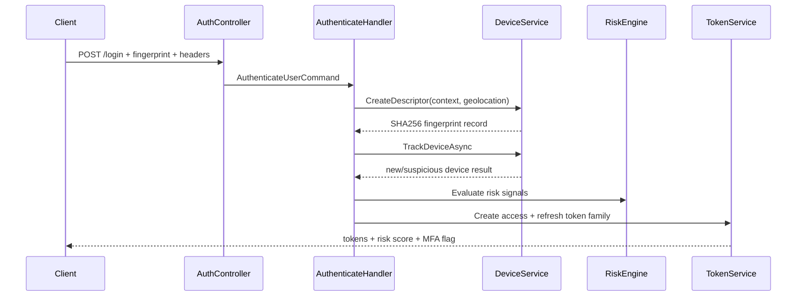
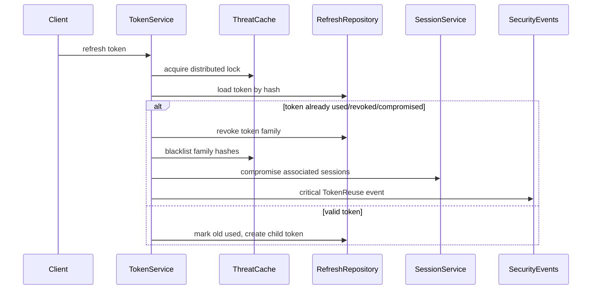

# Enterprise Threat Detection Report

## Architecture

The security layer is integrated into the existing Clean Architecture flow:

- API captures request context: `User-Agent`, `Accept-Language`, IP, timezone, platform, device name, browser, and relevant headers.
- Application commands carry security context through CQRS handlers.
- Infrastructure services generate server-side SHA256 device fingerprints, evaluate risk, cache threats, track token families, and record `SecurityEvent` entries.
- Sessions store risk, MFA requirement, compromise state, geolocation, device history, and token family identifiers.

## Fingerprint Flow

## Token Reuse Flow

## Adaptive MFA Flow

Risk scoring uses these signals: new device, suspicious device, fingerprint mismatch, brute force, MFA failure, token reuse, suspicious IP, impossible travel, and refresh abuse.

- `0-30`: low risk.
- `31-70`: suspicious, requires adaptive MFA and throttling.
- `71-100`: critical, revoke or block depending on signal.

## Session Intelligence

Session APIs expose:

- trusted devices
- suspicious sessions
- active threats
- device history
- compromised sessions
- per-session risk score
- adaptive MFA requirement

## Redis Threat Cache

The threat cache supports:

- fingerprint and suspicious IP flags
- brute-force counters
- refresh abuse counters
- token blacklist
- compromised-session cache
- distributed locks for concurrent refresh protection
- Redis atomic increments when Redis is configured, with distributed-memory fallback for local development

## Metrics

OpenTelemetry exports security counters through the `rbac.security.metrics` meter:

- `suspicious_logins_total`
- `brute_force_attempts_total`
- `token_reuse_total`
- `impossible_travel_total`
- `suspicious_devices_total`
- `compromised_sessions_total`
- `adaptive_mfa_total`

Suggested Grafana dashboards:

- Threat Detection: event volume by type and severity.
- Security Analytics: risk score distribution and suspicious IPs.
- Session Intelligence: active, suspicious, and compromised sessions.
- Adaptive MFA: MFA challenges by risk signal.

## Security Gains

- Refresh token families prevent silent replay.
- Reuse detection revokes the full family and associated sessions.
- Device fingerprints are generated consistently server-side from stable request signals.
- Suspicious device changes and mismatches create auditable security events.
- Brute-force protection uses per-user, per-IP, and per-fingerprint counters.
- Impossible travel raises high-risk events for impossible geolocation changes.
- Middleware blocks malformed tokens and abnormal refresh/header patterns before controllers execute.

## Performance Impact

The normal login path adds one fingerprint lookup, one geolocation attempt with short timeout, and small Redis/cache operations. The refresh path adds one distributed lock, one token lookup, and lightweight risk counters. Redis is used for hot-path counters and flags to avoid adding database pressure during attack bursts.
